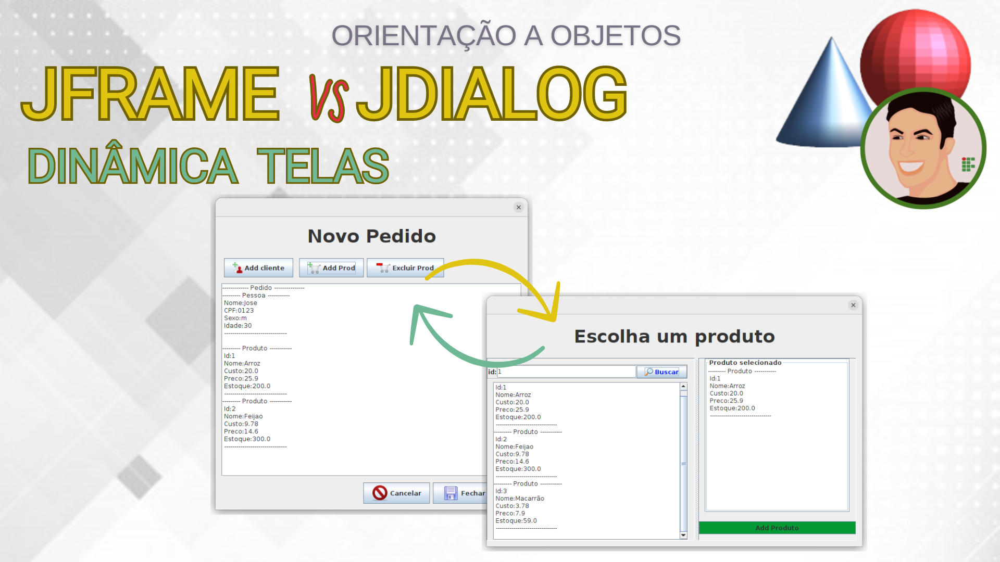

# ProjPedidoProdutos (Dinâmica Telas)

- Projeto Pedido de Produtos para ensinar Dinamica de telas
- Relaciona em um Pedido, um cliente e uma coleção de Produtos

## Conteudo

- GerenciadorProduto, GerenciadorCliente
- Usa interface Grafica (Java Swing)
- Serialização CSV, FilePersistence

- JDialog vs JFrame
- Dinamica de telas

